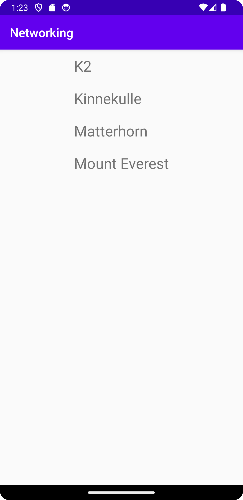
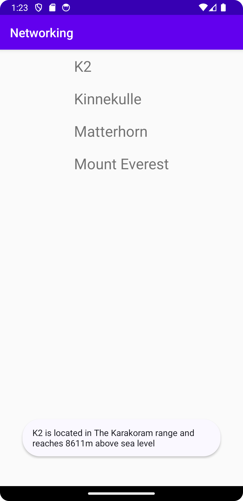

# Rapport

Jag har skapat en recycler view samt en RecyclerViewAdapter klass och satt adaptern till den viewen.
Adaptern använder mountainList arraylisten. MountainList får sin data från gson.fromJson, den datan hämtas från FamousPeaksJSON URL.
Klickar man på ett berg så kommer en kort Toast upp med mountain.info() metoden som visar kort info om det specifika berget.
Jag har även skapat en Mountain klass för att hantera bergen, samt en recycler_layout.xml fil.

```
    @Override
    protected void onCreate(Bundle savedInstanceState) {
        super.onCreate(savedInstanceState);
        setContentView(R.layout.activity_main);

        adapter = new RecyclerViewAdapter(this, mountainList, new RecyclerViewAdapter.OnClickListener() {
            @Override
            public void onClick(Mountain mountain) {
                Toast.makeText(MainActivity.this, mountain.info(), Toast.LENGTH_SHORT).show();
            }
        });

        RecyclerView view = findViewById(R.id.recycler_view);
        view.setLayoutManager(new LinearLayoutManager(this));
        view.setAdapter(adapter);

        //new JsonFile(this, this).execute(JSON_FILE);
        new JsonTask(this).execute(JSON_URL);
    }
```


